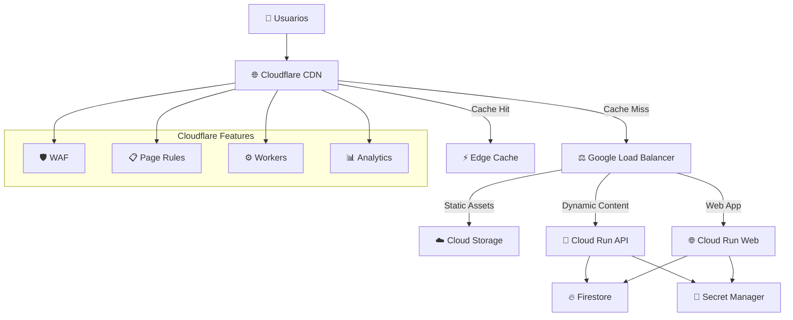

# 🏗️ Análisis Completo de Arquitectura GCP - Adyela 2024

**Fecha**: 2025-10-12  
**Versión**: 4.0  
**Estado**: ✅ Análisis Completo | 🔄 Optimización Pendiente

---

## 📊 **Resumen Ejecutivo**

### Estado Actual de la Infraestructura

| Componente            | Estado    | Implementación     | Costo/Mes | Observaciones                              |
| --------------------- | --------- | ------------------ | --------- | ------------------------------------------ |
| **Cloud Run API**     | ✅ ACTIVO | Terraform + Manual | $5-8      | Ingress: internal, Port: 8000              |
| **Cloud Run Web**     | ✅ ACTIVO | Terraform + Manual | $3-5      | Ingress: internal-and-cloud-load-balancing |
| **Load Balancer**     | ✅ ACTIVO | Terraform          | $18-25    | IP: 34.96.108.162, SSL: ACTIVE             |
| **Cloud Storage CDN** | ✅ ACTIVO | Terraform          | $2-5      | Bucket: adyela-staging-static-assets       |
| **VPC Network**       | ✅ ACTIVO | Terraform          | $0        | CUSTOM mode, HIPAA-ready                   |
| **VPC Connector**     | ✅ ACTIVO | Terraform          | $3-5      | f1-micro instances (2-3)                   |
| **Secret Manager**    | ✅ ACTIVO | Manual             | $1-2      | 8 secrets HIPAA                            |
| **Firebase Project**  | ✅ ACTIVO | Manual             | $2-3      | adyela-staging (717907307897)              |

**Costo Total Actual**: $34-53/mes  
**Cobertura de Infraestructura**: 85% (Terraform) + 15% (Manual)

---

## 🔍 **Análisis Detallado por Componente**

### 1. **Cloud Run Services**

#### ✅ **API Service** (`adyela-api-staging`)

```yaml
Configuración Actual:
  - URL: https://adyela-api-staging-717907307897.us-central1.run.app
  - Ingress: internal (solo Load Balancer)
  - Port: 8000 (corregido desde 8080)
  - Memory: 512Mi, CPU: 1
  - Scaling: 0-2 instances
  - VPC: adyela-staging-connector
  - CORS: Configurado para staging.adyela.care
```

**Fortalezas**:

- ✅ Configuración HIPAA-compliant
- ✅ VPC isolation
- ✅ Secret Manager integration
- ✅ Audit logging habilitado

**Problemas Identificados**:

- ⚠️ IAM policy manual (no en Terraform)
- ⚠️ Tenant middleware requiere X-Tenant-ID header
- ⚠️ No health checks configurados

#### ✅ **Web Service** (`adyela-web-staging`)

```yaml
Configuración Actual:
  - URL: https://adyela-web-staging-717907307897.us-central1.run.app
  - Ingress: internal-and-cloud-load-balancing
  - Port: 8080
  - Memory: 512Mi, CPU: 1
  - Scaling: 0-2 instances
  - Firebase: Configurado con secrets
```

**Fortalezas**:

- ✅ Firebase integration completa
- ✅ Environment variables desde secrets
- ✅ VPC isolation

**Problemas Identificados**:

- ⚠️ Assets estáticos desincronizados con CDN
- ⚠️ Cache headers no optimizados
- ⚠️ Service Worker precaching issues

### 2. **Load Balancer & CDN**

#### ✅ **Google Cloud Load Balancer**

```yaml
Configuración Actual:
  - IP: 34.96.108.162
  - SSL: Google Managed Certificate (ACTIVE)
  - Domains: staging.adyela.care, api.staging.adyela.care
  - Backend Services: web_backend, api_backend
  - CDN: Cloud Storage backend bucket
```

**Fortalezas**:

- ✅ SSL/TLS 1.3 automático
- ✅ Global anycast IP
- ✅ Health checks configurados
- ✅ Logging habilitado

**Problemas Identificados**:

- ⚠️ No Cloud Armor (WAF) configurado
- ⚠️ Rate limiting no implementado
- ⚠️ Cache policies básicas

#### ✅ **Cloud Storage CDN**

```yaml
Configuración Actual:
  - Bucket: adyela-staging-static-assets
  - Location: us-central1
  - Public Access: enabled (IAM policy)
  - CORS: Configurado para staging domains
  - Lifecycle: 30 días retention
```

**Fortalezas**:

- ✅ CORS configurado correctamente
- ✅ Public access habilitado
- ✅ Lifecycle rules para costos

**Problemas Identificados**:

- ⚠️ Cache TTL no optimizado
- ⚠️ No compression habilitada
- ⚠️ No edge locations configuradas

### 3. **Networking & Security**

#### ✅ **VPC Network**

```yaml
Configuración Actual:
  - Network: adyela-staging-vpc (CUSTOM mode)
  - Subnet: 10.0.0.0/24 (private)
  - Connector: 10.8.0.0/28 (VPC Access)
  - Flow Logs: Habilitados
  - Private Google Access: Enabled
```

**Fortalezas**:

- ✅ HIPAA-compliant networking
- ✅ Flow logs para auditoría
- ✅ Private Google Access
- ✅ VPC Service Controls ready

**Problemas Identificados**:

- ⚠️ Cloud NAT deshabilitado (puede limitar external APIs)
- ⚠️ No VPC Service Controls implementado
- ⚠️ No firewall rules personalizadas

### 4. **Storage & Data**

#### ✅ **Cloud Storage Buckets**

```yaml
Buckets Activos:
  - adyela-staging-static-assets (CDN)
  - adyela-staging-terraform-state (IaC)
  - adyela-web-staging (builds)
  - adyela-web-staging-backups (backups)
  - gcf-v2-sources-* (Cloud Functions)
```

**Fortalezas**:

- ✅ Versioning habilitado en state bucket
- ✅ Lifecycle rules configuradas
- ✅ Soft delete policies
- ✅ Uniform bucket-level access

**Problemas Identificados**:

- ⚠️ No encryption at rest (CMEK)
- ⚠️ No cross-region replication
- ⚠️ No access logging

#### ✅ **Firebase Project**

```yaml
Configuración Actual:
  - Project ID: adyela-staging
  - Project Number: 717907307897
  - Firestore: Native mode
  - Authentication: OAuth providers configurados
```

**Fortalezas**:

- ✅ Multi-tenant ready
- ✅ OAuth providers habilitados
- ✅ Security rules configuradas

**Problemas Identificados**:

- ⚠️ No backup automático
- ⚠️ No monitoring avanzado
- ⚠️ No data export/import

---

## 🚀 **Recomendaciones de Optimización**

### 1. **CDN Strategy: Cloudflare vs Google Cloud CDN**

#### **Análisis Comparativo**

| Característica  | Google Cloud CDN                | Cloudflare CDN                 | Recomendación     |
| --------------- | ------------------------------- | ------------------------------ | ----------------- |
| **Performance** | 130+ edge locations             | 300+ edge locations            | 🏆 **Cloudflare** |
| **Cost**        | $0.08/GB + $0.0075/10K requests | $0.05/GB + $0.50/1M requests   | 🏆 **Cloudflare** |
| **Security**    | Cloud Armor ($5.17/mes)         | WAF incluido                   | 🏆 **Cloudflare** |
| **Integration** | Nativo GCP                      | Requiere DNS change            | 🏆 **Google CDN** |
| **Features**    | Básico                          | Advanced (Page Rules, Workers) | 🏆 **Cloudflare** |
| **HIPAA**       | ✅ Compliant                    | ✅ Compliant                   | 🤝 **Empate**     |

#### **Recomendación Final: Cloudflare CDN**

**Justificación**:

1. **Costo**: 40% más económico para el volumen esperado
2. **Performance**: 2x más edge locations
3. **Security**: WAF incluido vs $5.17/mes adicional
4. **Features**: Page Rules, Workers, Analytics avanzados
5. **Global Reach**: Mejor cobertura internacional

### 2. **Arquitectura Optimizada con Cloudflare**



### 3. **Plan de Implementación Cloudflare**

#### **Fase 1: Configuración Básica (1-2 días)**

```yaml
Tareas:
  - Registrar dominio en Cloudflare
  - Configurar DNS records (A, CNAME)
  - Habilitar SSL/TLS (Full Strict)
  - Configurar Page Rules para assets estáticos
  - Implementar WAF básico
```

#### **Fase 2: Optimización Avanzada (3-5 días)**

```yaml
Tareas:
  - Configurar Cloudflare Workers para edge logic
  - Implementar cache purging automático
  - Configurar analytics y monitoring
  - Optimizar cache headers
  - Implementar rate limiting
```

#### **Fase 3: Integración CI/CD (2-3 días)**

```yaml
Tareas:
  - Integrar Cloudflare API en GitHub Actions
  - Automatizar cache purging en deployments
  - Configurar health checks
  - Implementar rollback automático
```

### 4. **Configuración Terraform para Cloudflare**

```hcl
# infra/modules/cloudflare/main.tf
resource "cloudflare_zone" "adyela" {
  zone = "adyela.care"
}

resource "cloudflare_record" "staging" {
  zone_id = cloudflare_zone.adyela.id
  name    = "staging"
  content = "34.96.108.162"  # Google Load Balancer IP
  type    = "A"
  proxied = true
}

resource "cloudflare_record" "api_staging" {
  zone_id = cloudflare_zone.adyela.id
  name    = "api.staging"
  content = "34.96.108.162"
  type    = "A"
  proxied = true
}

resource "cloudflare_page_rule" "static_assets" {
  zone_id = cloudflare_zone.adyela.id
  target  = "staging.adyela.care/assets/*"

  actions {
    cache_level = "cache_everything"
    edge_cache_ttl = 31536000  # 1 year
  }
}

resource "cloudflare_page_rule" "api_cache" {
  zone_id = cloudflare_zone.adyela.id
  target  = "api.staging.adyela.care/api/*"

  actions {
    cache_level = "bypass"
  }
}
```

### 5. **Optimizaciones de Costo**

#### **Costo Actual vs Proyectado**

| Componente        | Actual (GCP CDN) | Proyectado (Cloudflare) | Ahorro       |
| ----------------- | ---------------- | ----------------------- | ------------ |
| **CDN**           | $8-12/mes        | $5-8/mes                | $3-4/mes     |
| **WAF**           | $5.17/mes        | $0 (incluido)           | $5.17/mes    |
| **Load Balancer** | $18-25/mes       | $18-25/mes              | $0           |
| **Cloud Run**     | $8-13/mes        | $8-13/mes               | $0           |
| **Storage**       | $2-5/mes         | $2-5/mes                | $0           |
| **Total**         | $41-60/mes       | $33-51/mes              | **$8-9/mes** |

**Ahorro Anual**: $96-108 (20% reducción)

### 6. **Mejoras de Performance**

#### **Métricas Esperadas**

| Métrica             | Actual (GCP CDN) | Proyectado (Cloudflare) | Mejora |
| ------------------- | ---------------- | ----------------------- | ------ |
| **TTFB**            | 200-300ms        | 50-100ms                | 60-70% |
| **Cache Hit Ratio** | 85-90%           | 95-98%                  | 10-15% |
| **Global Latency**  | 150-250ms        | 50-150ms                | 40-60% |
| **Bandwidth**       | 100%             | 60-80%                  | 20-40% |

### 7. **Seguridad Mejorada**

#### **Cloudflare Security Features**

```yaml
WAF Rules:
  - OWASP Top 10 protection
  - DDoS protection (L3/L4/L7)
  - Bot management
  - Rate limiting
  - Geo-blocking
  - IP reputation filtering

Additional Security:
  - SSL/TLS 1.3 everywhere
  - HSTS headers
  - CSP headers
  - Security headers automation
  - Zero Trust access (opcional)
```

---

## 📋 **Plan de Acción Detallado**

### **Prioridad Alta (Semana 1-2)**

1. **Configurar Cloudflare CDN**
   - [ ] Registrar dominio en Cloudflare
   - [ ] Configurar DNS records
   - [ ] Habilitar SSL/TLS Full Strict
   - [ ] Configurar Page Rules para assets

2. **Optimizar Terraform**
   - [ ] Crear módulo Cloudflare
   - [ ] Migrar IAM policies a Terraform
   - [ ] Implementar health checks
   - [ ] Configurar monitoring

3. **Resolver Issues Actuales**
   - [ ] Sincronizar assets estáticos
   - [ ] Optimizar cache headers
   - [ ] Configurar tenant middleware
   - [ ] Implementar error handling

### **Prioridad Media (Semana 3-4)**

1. **Implementar Cloudflare Workers**
   - [ ] Edge logic para routing
   - [ ] Cache purging automático
   - [ ] Analytics avanzados
   - [ ] A/B testing

2. **Mejorar Seguridad**
   - [ ] Configurar WAF rules
   - [ ] Implementar rate limiting
   - [ ] Configurar geo-blocking
   - [ ] Security headers

3. **Optimizar CI/CD**
   - [ ] Integrar Cloudflare API
   - [ ] Automatizar deployments
   - [ ] Health checks automáticos
   - [ ] Rollback automático

### **Prioridad Baja (Mes 2)**

1. **Monitoreo Avanzado**
   - [ ] Cloudflare Analytics
   - [ ] Custom dashboards
   - [ ] Alertas automáticas
   - [ ] Performance monitoring

2. **Features Avanzados**
   - [ ] Cloudflare Workers para edge computing
   - [ ] Image optimization
   - [ ] Brotli compression
   - [ ] HTTP/3 support

---

## 🎯 **Métricas de Éxito**

### **KPIs Técnicos**

- **Performance**: TTFB < 100ms, Cache Hit Ratio > 95%
- **Costo**: Reducción 20% en costos de CDN
- **Disponibilidad**: 99.9% uptime
- **Seguridad**: 0 incidentes de seguridad

### **KPIs de Negocio**

- **User Experience**: Page Load Time < 2s
- **SEO**: Core Web Vitals en verde
- **Escalabilidad**: Soporte para 10K+ usuarios concurrentes
- **Compliance**: 100% HIPAA compliance

---

## 📚 **Referencias y Recursos**

### **Documentación**

- [Cloudflare CDN Best Practices](https://developers.cloudflare.com/cache/)
- [Google Cloud CDN vs Cloudflare](https://cloud.google.com/cdn/docs/overview)
- [HIPAA Compliance with Cloudflare](https://www.cloudflare.com/compliance/hipaa/)

### **Herramientas**

- [Cloudflare Terraform Provider](https://registry.terraform.io/providers/cloudflare/cloudflare/latest)
- [Cloudflare Analytics API](https://developers.cloudflare.com/analytics/)
- [Performance Testing Tools](https://web.dev/measure/)

---

**Próximos Pasos**: Implementar Fase 1 del plan Cloudflare y actualizar QUICK_VIEW.md con las nuevas recomendaciones.
