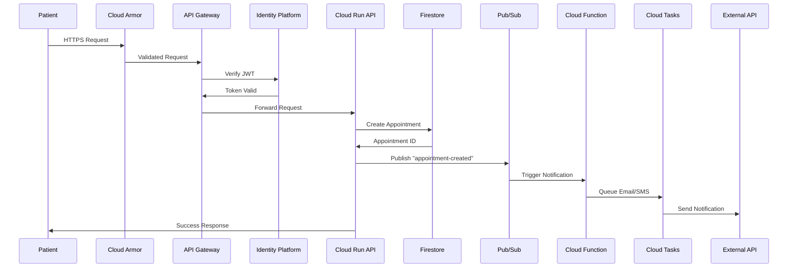
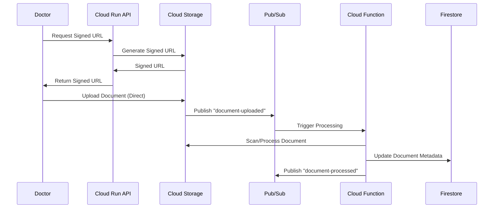
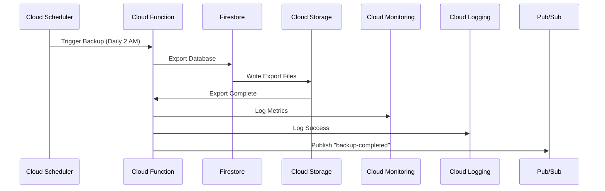

# Adyela GCP Architecture - Comprehensive Guide

## Overview

This document explains the complete Google Cloud Platform architecture for the Adyela health system, covering both staging and production environments with HIPAA compliance.

## Diagram

**File**: `adyela-gcp-architecture.drawio`

**How to open**:

1. Visit [draw.io](https://app.diagrams.net/)
2. File → Open → Select `adyela-gcp-architecture.drawio`
3. Or use VS Code with Draw.io Integration extension

---

## Architecture Layers

### 1. External Users Layer

**Purpose**: Define all types of users accessing the system

| User Type      | Access Level         | Environment | Key Features                                               |
| -------------- | -------------------- | ----------- | ---------------------------------------------------------- |
| **Patients**   | End users            | Both        | Book appointments, view records, video consultations       |
| **Doctors**    | Healthcare providers | Both        | Manage appointments, access records, conduct consultations |
| **Admins**     | Organization admins  | Both        | User management, organization settings                     |
| **Ops Team**   | Operations/DevOps    | Production  | Monitoring, incident response, deployments                 |
| **Developers** | Development team     | Staging     | Testing, debugging, feature development                    |

---

### 2. DNS & CDN Layer

#### Components

**Cloud DNS** (`adyela.care`)

- Managed DNS service
- Low latency globally
- DNSSEC enabled
- Health checks integration

**Staging Domain** (`staging.adyela.care`)

- Points to staging environment
- Used for QA and testing
- Accessible to internal team

**Production Domains**

- `app.adyela.care` - Web application
- `api.adyela.care` - API backend
- Separate domains for security isolation

**Cloud CDN**

- Caches static assets
- Global edge locations
- SSL/TLS termination
- DDoS protection

---

## Staging Environment (`adyela-staging`)

### Purpose

- QA and integration testing
- Feature validation before production
- E2E testing environment
- Performance testing

### Cost Optimization Strategy

- **Scale to zero**: min-instances=0 (save costs when not used)
- **Limited scaling**: max-instances=1-2
- **Minimal resources**: 512Mi RAM, 1 CPU
- **Estimated cost**: $5-10/month

### Security & Edge Layer

#### 1. Cloud Armor (WAF)

- **Purpose**: Web Application Firewall
- **Features**:
  - OWASP Top 10 protection
  - Rate limiting
  - IP allowlist/denylist
  - Geo-blocking rules
- **Configuration**:
  ```yaml
  rate_limit: 1000 req/min per IP
  geo_block: [] (none in staging)
  owasp_rules: preconfigured-waf-v1
  ```

#### 2. API Gateway

- **Purpose**: API management and routing
- **Features**:
  - TLS termination
  - JWT verification
  - Rate limiting per endpoint
  - Request/response transformation
- **Configuration**:
  ```yaml
  tls_version: 1.3
  auth_provider: Identity Platform
  rate_limit: 100 req/sec per user
  ```

#### 3. Load Balancer

- **Type**: Global HTTPS Load Balancer
- **Purpose**: Route traffic to Cloud Run services
- **Features**:
  - SSL certificate management (Let's Encrypt)
  - Health checks
  - Session affinity
- **Backend**: Cloud Run services

#### 4. Identity Platform

- **Purpose**: User authentication and authorization
- **Features**:
  - JWT token generation
  - MFA (Multi-Factor Authentication)
  - Email/password authentication
  - OAuth2/OIDC providers
- **Configuration**:
  ```yaml
  mfa_required: false (staging)
  session_duration: 1 hour
  refresh_token: 30 days
  ```

### Compute & Services Layer

#### 1. Cloud Run - API Service

- **Image**: `us-central1-docker.pkg.dev/adyela-staging/adyela/adyela-api-staging`
- **Configuration**:
  ```yaml
  min_instances: 0 # Scale to zero
  max_instances: 1
  memory: 512Mi
  cpu: 1
  timeout: 300s
  concurrency: 80
  ```
- **Environment Variables**:
  - `ENVIRONMENT=staging`
  - `GCP_PROJECT_ID=adyela-staging`
- **Secrets** (from Secret Manager):
  - `SECRET_KEY`
  - `FIREBASE_PROJECT_ID`

#### 2. Cloud Run - Web App (PWA)

- **Image**: `us-central1-docker.pkg.dev/adyela-staging/adyela/adyela-web-staging`
- **Configuration**:
  ```yaml
  min_instances: 0
  max_instances: 2
  memory: 256Mi
  cpu: 1
  timeout: 60s
  port: 8080
  ```
- **Features**:
  - Progressive Web App
  - Offline support
  - Service workers
  - React + TypeScript

#### 3. Cloud Functions

- **Purpose**: Serverless event-driven functions
- **Use Cases**:
  - Image processing
  - PDF generation
  - Email sending
  - Notification triggers
- **Triggers**:
  - HTTP
  - Pub/Sub
  - Cloud Storage
  - Firestore

#### 4. Cloud Scheduler

- **Purpose**: Cron job scheduling
- **Jobs**:
  - Database cleanup (daily 2 AM)
  - Backup verification (daily 3 AM)
  - Report generation (weekly)
  - Health checks (hourly)

### Data & Storage Layer

#### 1. Firestore (Native Mode)

- **Purpose**: Primary database for transactional data
- **Data Model**: Multi-tenant (see PRD)
- **Collections**:
  ```
  tenants/{tenantId}/
    patients/{patientId}
    providers/{providerId}
    appointments/{appointmentId}
    conversations/{conversationId}
    documents/{docId}
  ```
- **Indexes**: Composite indexes for queries
- **Backups**: Daily export to Cloud Storage

#### 2. Cloud Storage

- **Buckets**:
  - `adyela-staging-documents` - Patient documents
  - `adyela-staging-backups` - Database backups
  - `adyela-staging-reports` - Generated reports
- **Configuration**:
  ```yaml
  lifecycle:
    - delete_after: 30 days (backups)
  versioning: enabled
  encryption: Google-managed
  ```

#### 3. Secret Manager

- **Purpose**: Store sensitive configuration
- **Secrets**:
  - `api-secret-key` - Application secret
  - `firebase-project-id` - Firebase config
  - `smtp-credentials` - Email service
  - `twilio-api-key` - SMS service
- **Rotation**: Manual (not required in staging)

### Async Processing Layer

#### 1. Pub/Sub (Event Bus)

- **Purpose**: Asynchronous event processing
- **Topics**:
  - `appointment-created` - New appointment events
  - `appointment-cancelled` - Cancellation events
  - `document-uploaded` - Document processing
  - `notification-queue` - Notifications
- **Subscriptions**: Push to Cloud Functions

#### 2. Cloud Tasks

- **Purpose**: Task queue for deferred execution
- **Queues**:
  - `email-queue` - Email sending
  - `sms-queue` - SMS notifications
  - `reminder-queue` - Appointment reminders
- **Configuration**:
  ```yaml
  max_concurrent_dispatches: 10
  max_attempts: 3
  max_retry_duration: 1h
  ```

### Observability Layer

#### 1. Cloud Logging

- **Purpose**: Centralized log management
- **Log Types**:
  - Application logs
  - Access logs
  - Audit logs
- **Retention**: 30 days (staging)

#### 2. Cloud Monitoring

- **Purpose**: Metrics and dashboards
- **Metrics**:
  - Request latency
  - Error rates
  - CPU/Memory usage
  - Firestore operations
- **Dashboards**: Custom dashboards per service

#### 3. Cloud Trace

- **Purpose**: Distributed tracing
- **Features**:
  - Request tracing across services
  - Latency analysis
  - Bottleneck identification

#### 4. Error Reporting

- **Purpose**: Error aggregation and alerting
- **Features**:
  - Automatic error grouping
  - Stack trace analysis
  - Email notifications

---

## Production Environment (`adyela-production`)

### Purpose

- Live healthcare system
- Patient data (PHI)
- HIPAA compliant
- High availability
- 24/7 monitoring

### Differences from Staging

| Aspect               | Staging           | Production              |
| -------------------- | ----------------- | ----------------------- |
| **Min Instances**    | 0 (scale to zero) | 1-2 (always-on)         |
| **Max Instances**    | 1-2               | 10                      |
| **Memory**           | 512Mi             | 1Gi                     |
| **CPU**              | 1                 | 2                       |
| **Encryption**       | Google-managed    | CMEK (Customer-Managed) |
| **VPC-SC**           | No                | Yes (perimeter)         |
| **Backup Retention** | 30 days           | 7 years (HIPAA)         |
| **Audit Logs**       | 30 days           | 7 years (2555 days)     |
| **MFA**              | Optional          | Required                |
| **Cost**             | $5-10/month       | $200-500/month          |

### Enhanced Security

#### VPC Service Controls

- **Purpose**: Data exfiltration prevention
- **Perimeter**: Isolates GCP resources
- **Restricted Services**:
  - Cloud Run
  - Firestore
  - Cloud Storage
  - Secret Manager
- **Access Levels**:
  - Only from authorized IPs
  - Only with valid identity

#### CMEK (Customer-Managed Encryption Keys)

- **Purpose**: Customer control over encryption
- **Key Management**: Cloud KMS
- **Encrypted Resources**:
  - Firestore data
  - Cloud Storage buckets
  - Secret Manager secrets
- **Key Rotation**: Automatic (90 days)

#### Enhanced Cloud Armor

- **Additional Rules**:
  - Geo-blocking (non-LATAM)
  - Advanced bot detection
  - Application-specific rules
  - Custom WAF rules

#### SSO Integration

- **Providers**:
  - Google Workspace
  - Microsoft Azure AD
  - SAML 2.0
- **Purpose**: Enterprise authentication

### Enhanced Observability

#### SLO/SLI Monitoring

- **Service Level Objectives**:
  - Availability: 99.9% uptime
  - Latency: p95 < 500ms
  - Error rate: < 0.1%

#### Uptime Checks

- **Frequency**: Every 1 minute
- **Locations**: Global (5 regions)
- **Alerts**: PagerDuty integration

#### Advanced Alerting

- **Channels**:
  - PagerDuty (critical)
  - Slack (warnings)
  - Email (info)
- **Alert Policies**:
  - Error rate > 1%
  - Latency p95 > 1s
  - Memory usage > 80%
  - Firestore errors

---

## Shared Services & Operations

### CI/CD Pipeline

#### Cloud Build

- **Purpose**: Build and push Docker images
- **Triggers**:
  - GitHub push to main/staging
  - Manual workflow dispatch
- **Steps**:
  1. Checkout code
  2. Run tests
  3. Build Docker image
  4. Scan with Trivy
  5. Push to Artifact Registry
  6. Deploy to Cloud Run

#### Artifact Registry

- **Purpose**: Docker image registry
- **Repositories**:
  - `adyela` - Application images
- **Images**:
  - `adyela-api-staging:v1.2.3`
  - `adyela-api-production:v1.2.3`
  - `adyela-web-staging:v1.2.3`
  - `adyela-web-production:v1.2.3`
- **Scanning**: Vulnerability scanning enabled

#### GitHub Actions

- **Workflows**:
  - `ci-api.yml` - API CI pipeline
  - `ci-web.yml` - Web CI pipeline
  - `cd-staging.yml` - Staging deployment
  - `cd-production.yml` - Production deployment
- **Secrets**:
  - `WORKLOAD_IDENTITY_PROVIDER`
  - `SERVICE_ACCOUNT`
  - `GCP_PROJECT_ID`

### Infrastructure as Code

#### Terraform

- **Purpose**: Provision and manage GCP resources
- **Structure**:
  ```
  infra/
  ├── modules/
  │   ├── network/
  │   ├── identity/
  │   ├── api_gateway/
  │   ├── cloud_run/
  │   ├── firestore/
  │   ├── storage/
  │   ├── pubsub/
  │   ├── monitoring/
  │   └── security/
  ├── environments/
  │   ├── staging/
  │   └── production/
  └── backend.tf
  ```
- **Modules** (per Epic):
  - EP-NET: Network configuration
  - EP-IDP: Identity Platform
  - EP-API: API Gateway
  - EP-DATA: Firestore + Storage
  - EP-SEC: Security controls
  - EP-RUN: Cloud Run services
  - EP-ASYNC: Pub/Sub + Tasks
  - EP-OBS: Monitoring
  - EP-COST: Budgets

#### GCS Backend

- **Purpose**: Store Terraform state
- **Bucket**: `adyela-terraform-state`
- **Configuration**:
  ```hcl
  terraform {
    backend "gcs" {
      bucket = "adyela-terraform-state"
      prefix = "terraform/state"
    }
  }
  ```
- **Features**:
  - State locking
  - Versioning enabled
  - Encryption at rest

### Governance & Cost Management

#### Budget Alerts

- **Budgets**:
  - Staging: $20/month
  - Production: $500/month
- **Alerts**:
  - 50% - Email notification
  - 75% - Email + Slack
  - 90% - Email + Slack + PagerDuty
  - 100% - Email + Slack + PagerDuty (critical)

#### Cost Monitoring

- **Dashboards**:
  - Cost by service
  - Cost by environment
  - Cost trends (daily/weekly/monthly)
- **Optimization**:
  - Committed use discounts
  - Sustained use discounts
  - Resource rightsizing

#### Organization Policies

- **Policies**:
  - Restrict resource locations (us-central1)
  - Require encryption at rest
  - Disable public IPs
  - Require labels on resources
- **Enforcement**: Organization level

### Security Center

#### Security Command Center

- **Purpose**: Centralized security management
- **Features**:
  - Vulnerability scanning
  - Asset discovery
  - Threat detection
  - Compliance monitoring
- **Findings**: Automatic remediation via Cloud Functions

#### Audit Logs

- **Types**:
  - Admin Activity logs (who did what)
  - Data Access logs (PHI access - HIPAA required)
  - System Event logs
- **Retention**: 7 years (2555 days) for HIPAA
- **Storage**: Cloud Logging + Cloud Storage export

---

## Data Flow Examples

### 1. Patient Books Appointment



### 2. Document Upload



### 3. Scheduled Backup



---

## Network Architecture

### VPC Configuration

```
VPC: adyela-vpc (us-central1)
├── Subnet: serverless-subnet (10.8.0.0/28)
│   └── Purpose: Serverless VPC Access Connector
├── Subnet: private-subnet (10.10.0.0/16)
│   └── Purpose: Private Google Access
└── Firewall Rules:
    ├── allow-internal (10.0.0.0/8)
    ├── allow-health-checks (35.191.0.0/16, 130.211.0.0/22)
    └── deny-all-ingress (default)
```

### Serverless VPC Access

- **Connector**: `serverless-connector`
- **Machine Type**: e2-micro
- **Instances**: 2-10 (autoscaling)
- **Purpose**: Allow Cloud Run to access VPC resources

### Private Google Access

- **Purpose**: Access Google APIs without public IPs
- **Enabled on**: All subnets
- **Routes**: Private Google API endpoints

---

## Security Controls Summary

### Network Security

- ✅ Cloud Armor (WAF)
- ✅ VPC Service Controls (production)
- ✅ Private Google Access
- ✅ No public IPs on compute

### Data Security

- ✅ Encryption at rest (CMEK in production)
- ✅ Encryption in transit (TLS 1.3)
- ✅ Cloud Storage bucket policies (no public access)
- ✅ Signed URLs for document access

### Identity & Access

- ✅ Identity Platform (JWT + MFA)
- ✅ IAM roles (least privilege)
- ✅ Service accounts per service
- ✅ Workload Identity for GKE/Cloud Run

### Monitoring & Compliance

- ✅ Cloud Logging (7-year retention)
- ✅ Data Access Logs (PHI tracking)
- ✅ Security Command Center
- ✅ Audit logs for all admin operations

### Application Security

- ✅ Container scanning (Trivy)
- ✅ Dependency scanning (Snyk)
- ✅ SAST (CodeQL, Bandit)
- ✅ DAST (OWASP ZAP in staging)

---

## HIPAA Compliance Checklist

### Technical Safeguards

- ✅ **Access Control**: Identity Platform + MFA
- ✅ **Audit Controls**: 7-year audit logs
- ✅ **Integrity Controls**: Checksums on all documents
- ✅ **Transmission Security**: TLS 1.3 everywhere

### Physical Safeguards

- ✅ **Facility Access**: GCP data centers (SOC 2 certified)
- ✅ **Workstation Security**: Managed by GCP
- ✅ **Device Controls**: N/A (serverless)

### Administrative Safeguards

- ✅ **BAA with GCP**: Signed Business Associate Agreement
- ✅ **Security Management**: Security policies documented
- ✅ **Workforce Training**: Annual HIPAA training
- ✅ **Incident Response**: Documented procedures

### Data Safeguards

- ✅ **Encryption at Rest**: CMEK (production)
- ✅ **Encryption in Transit**: TLS 1.3
- ✅ **Backup & Recovery**: Daily backups, 7-year retention
- ✅ **Data Access Logs**: Track all PHI access

---

## Cost Estimates

### Staging Environment

```
Cloud Run API:        $2-3/month   (scale to zero)
Cloud Run Web:        $1-2/month   (scale to zero)
Firestore:            $1/month     (minimal usage)
Cloud Storage:        $1/month     (backups)
Networking:           $0.50/month  (minimal traffic)
Logging/Monitoring:   $0.50/month  (30-day retention)
─────────────────────────────────────────────────
Total:                $5-10/month
```

### Production Environment

```
Cloud Run API:        $50-100/month  (always-on, autoscale)
Cloud Run Web:        $30-50/month   (always-on, autoscale)
Firestore:            $30-50/month   (read/write operations)
Cloud Storage:        $20-30/month   (documents + backups)
Networking:           $20-40/month   (CDN + egress)
VPC-SC:               $10/month      (data perimeter)
Logging/Monitoring:   $30-50/month   (7-year retention)
Secret Manager:       $5/month       (secret operations)
Pub/Sub:              $5-10/month    (messages)
Cloud Tasks:          $5-10/month    (task executions)
Cloud Scheduler:      $1/month       (cron jobs)
Identity Platform:    $5-20/month    (MAU)
Cloud Armor:          $10-20/month   (WAF rules)
─────────────────────────────────────────────────
Total:                $221-431/month
Average:              ~$300/month
```

### Cost Optimization Tips

1. Use committed use discounts (30% savings)
2. Enable sustained use discounts (automatic)
3. Scale to zero in non-prod environments
4. Use lifecycle policies for old data
5. Monitor with budget alerts
6. Right-size Cloud Run instances
7. Use Cloud CDN for static assets
8. Compress logs before archiving

---

## Deployment Process

### Staging Deployment (Automatic)

1. Developer merges PR to `staging` branch
2. GitHub Actions triggers `cd-staging.yml`
3. Cloud Build builds Docker images
4. Trivy scans images for vulnerabilities
5. Images pushed to Artifact Registry
6. Cloud Run services updated
7. E2E tests run against staging
8. Performance tests execute
9. OWASP ZAP security scan
10. Notifications sent to Slack

### Production Deployment (Manual)

1. Create release PR from `staging` to `main`
2. 2 approvals required
3. Manual workflow dispatch with version tag
4. Approval checkpoint (required reviewer)
5. Cloud Build builds production images
6. Security scanning (stricter thresholds)
7. Images pushed to Artifact Registry
8. Canary deployment (10% traffic)
9. Monitor for 30 minutes
10. Full rollout or rollback
11. Health checks verification
12. Notifications sent

---

## Disaster Recovery

### RTO/RPO Targets

- **RTO (Recovery Time Objective)**: < 4 hours
- **RPO (Recovery Point Objective)**: < 1 hour

### Backup Strategy

- **Frequency**: Daily (2 AM UTC)
- **Retention**: 35 days (production), 30 days (staging)
- **Storage**: Cloud Storage (multi-region)
- **Verification**: Weekly restore tests

### Recovery Procedures

1. **Firestore Restore**:
   ```bash
   gcloud firestore import gs://adyela-backups/[DATE]
   ```
2. **Cloud Storage Restore**: Versioning enabled (automatic)
3. **Secret Manager**: Versioned (can rollback)
4. **Cloud Run**: Previous revisions retained (instant rollback)

### Incident Response

1. Alert received (PagerDuty)
2. On-call engineer assesses
3. Incident declared if needed
4. War room established (Slack)
5. Recovery procedures executed
6. Post-incident review (PIR)

---

## Monitoring & Alerting

### Key Metrics

#### Application Metrics

- Request latency (p50, p95, p99)
- Error rate (4xx, 5xx)
- Request count (per endpoint)
- Active connections

#### Infrastructure Metrics

- CPU utilization
- Memory utilization
- Container instance count
- Cold start latency

#### Business Metrics

- Appointments created
- Documents uploaded
- Active users (DAU/MAU)
- Video consultation minutes

### Alert Policies

#### Critical Alerts (PagerDuty)

- Error rate > 5%
- p95 latency > 2s
- Service down
- Firestore quota exceeded
- Budget exceeded

#### Warning Alerts (Slack)

- Error rate > 1%
- p95 latency > 1s
- Memory usage > 80%
- Storage usage > 75%

#### Info Alerts (Email)

- Deployment completed
- Backup completed
- Scheduled maintenance

---

## Future Enhancements

### Phase 2 (Q2 2026)

- [ ] Multi-region deployment (us-east1)
- [ ] HL7 FHIR integration
- [ ] DICOM image support
- [ ] Advanced analytics with BigQuery

### Phase 3 (Q3 2026)

- [ ] Mobile apps (iOS/Android)
- [ ] Telemedicine integrations
- [ ] AI-powered diagnosis support
- [ ] Patient portal v2

### Phase 4 (Q4 2026)

- [ ] International expansion (EU)
- [ ] GDPR compliance
- [ ] Multi-language support
- [ ] Advanced reporting

---

## References

### GCP Documentation

- [Cloud Run Documentation](https://cloud.google.com/run/docs)
- [Firestore Documentation](https://cloud.google.com/firestore/docs)
- [Identity Platform Documentation](https://cloud.google.com/identity-platform/docs)
- [VPC Service Controls](https://cloud.google.com/vpc-service-controls/docs)

### HIPAA Resources

- [HIPAA Compliance on GCP](https://cloud.google.com/security/compliance/hipaa)
- [GCP BAA](https://cloud.google.com/terms/service-terms)
- [HIPAA Security Rule](https://www.hhs.gov/hipaa/for-professionals/security/index.html)

### Internal Documentation

- [PRD](../.taskmaster/docs/health-system-prd.txt)
- [GitHub Audit Report](../GITHUB_AUDIT_REPORT.md)
- [Deployment Guide](../guides/deployment-guide.md)
- [Security Policy](../../SECURITY.md)

---

**Document Version**: 1.0.0  
**Last Updated**: October 11, 2025  
**Maintained By**: Adyela DevOps Team  
**Review Frequency**: Quarterly
