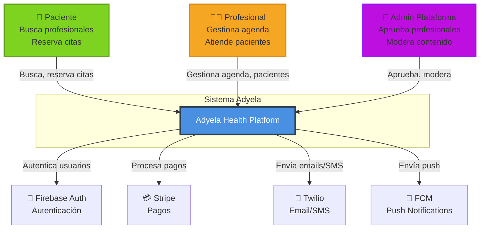
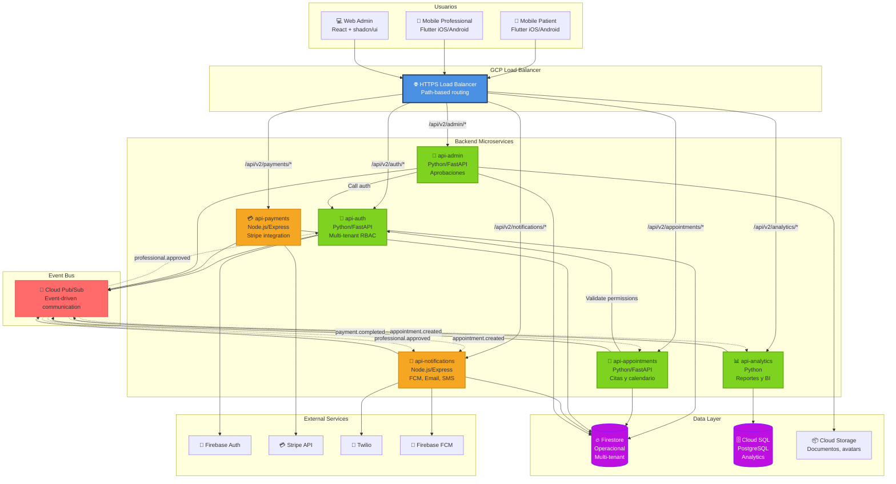
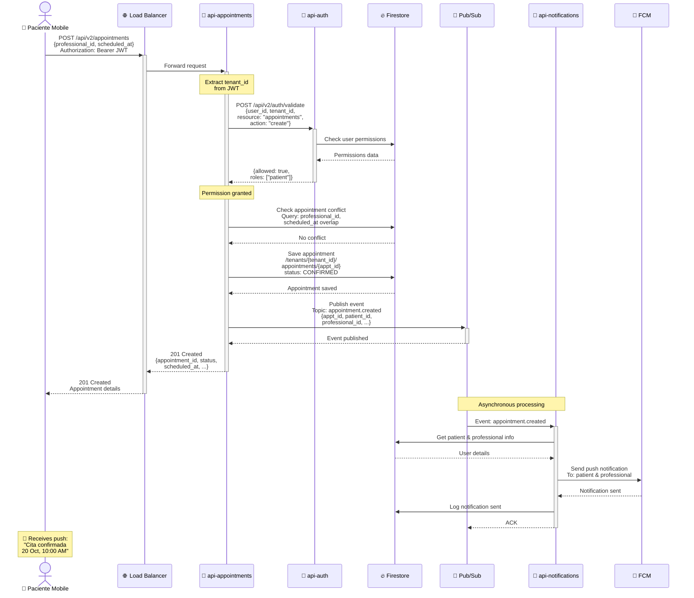
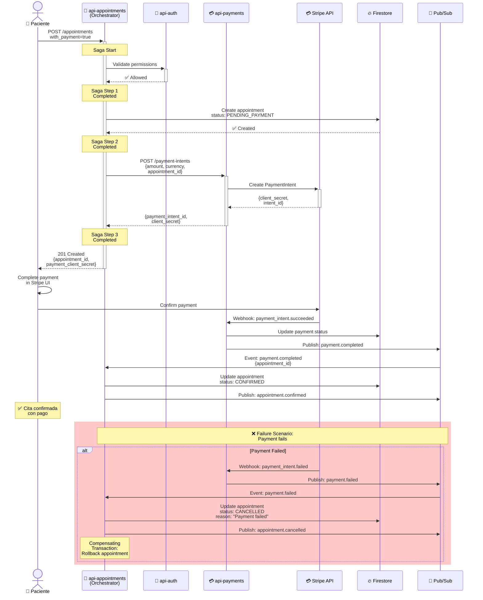
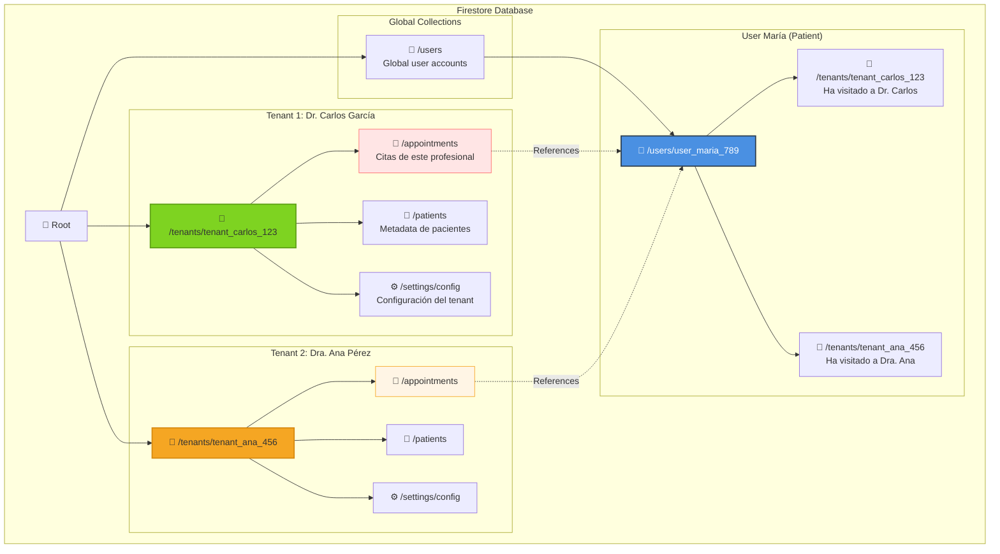
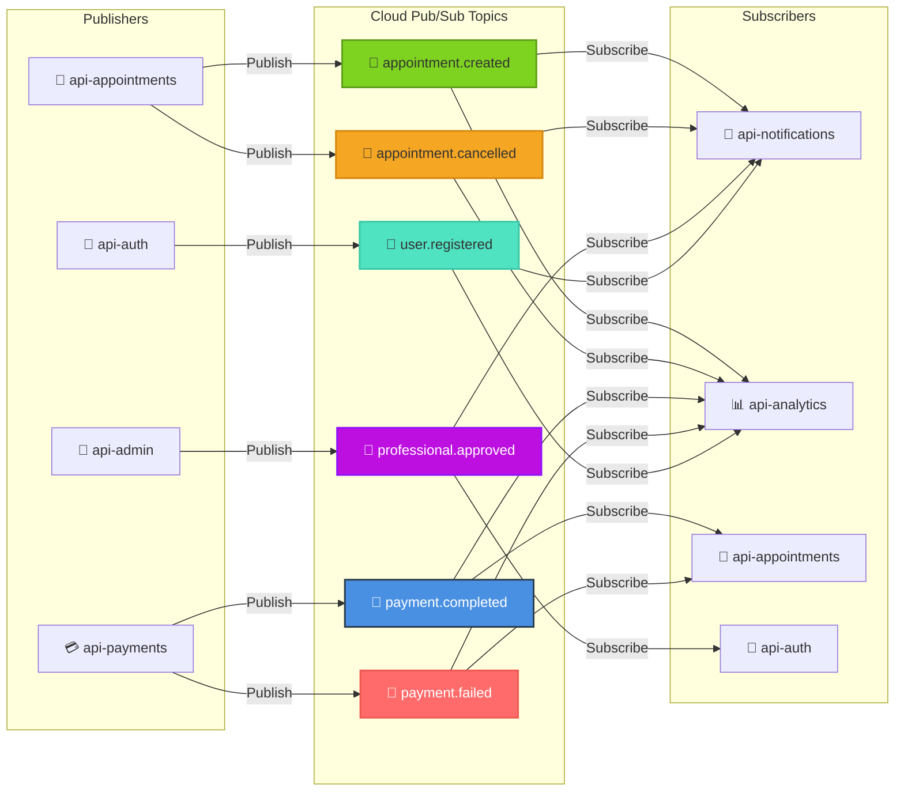
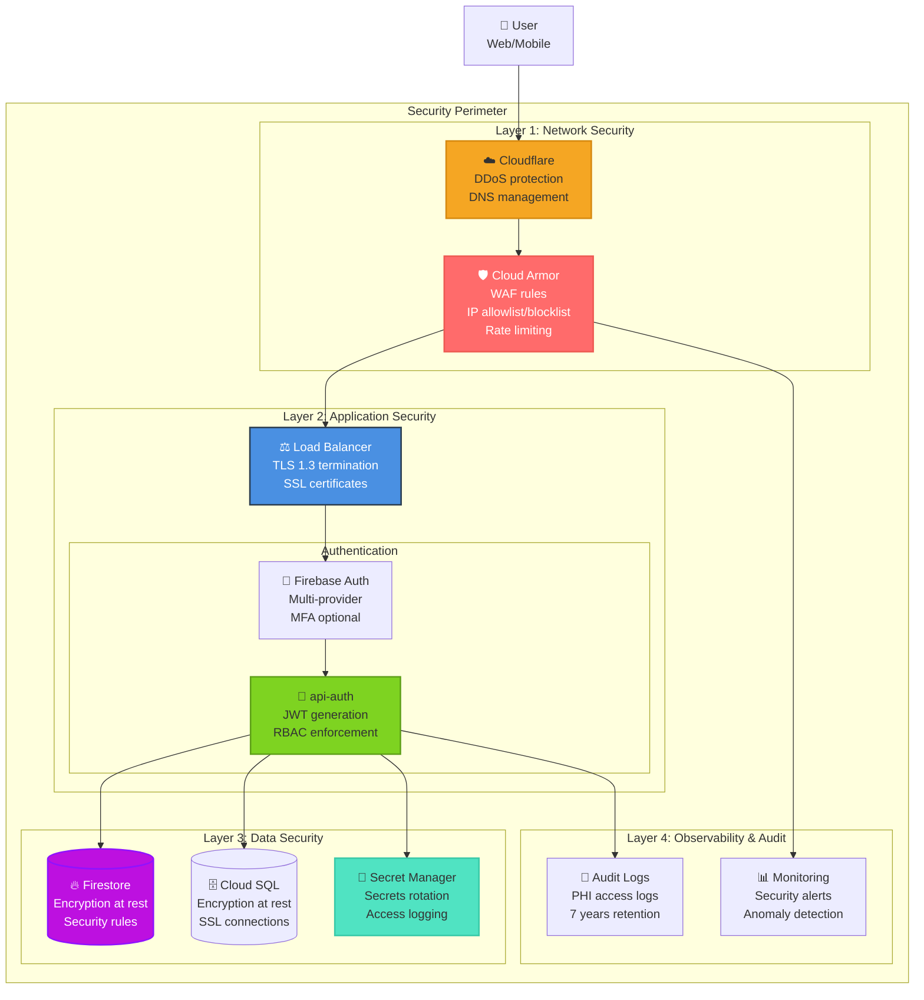
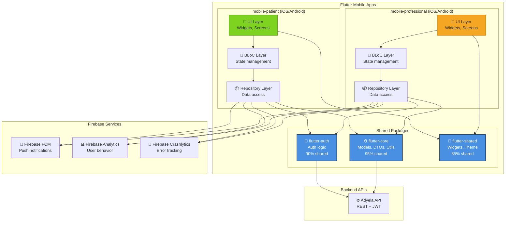

# Diagramas Arquitectónicos - Adyela Health Platform

## 📊 Resumen

Este documento contiene todos los diagramas arquitectónicos de la plataforma
Adyela, siguiendo el modelo C4 (Context, Container, Component, Code).

**Herramienta**: Mermaid (renderizable en GitHub, VS Code, Markdown viewers)

---

## 🌍 1. C4 Model - Level 1: System Context



---

## 📦 2. C4 Model - Level 2: Container Diagram



---

## 🔄 3. Diagrama de Secuencia: Reservar Cita



---

## 💳 4. Diagrama de Secuencia: Saga Pattern (Reserva con Pago)



---

## 🏗️ 5. Diagrama de Deployment (GCP)

```mermaid
graph TB
    subgraph "Internet"
        USER[👤 Users<br/>Web + Mobile]
    end

    subgraph "GCP - us-central1"
        subgraph "CDN Layer"
            CDN[☁️ Cloud CDN<br/>Static assets<br/>Cache hit ratio >80%]
        end

        subgraph "Security Layer"
            ARMOR[🛡️ Cloud Armor<br/>WAF + DDoS<br/>Rate limiting]
        end

        subgraph "Load Balancing"
            LB[⚖️ HTTPS Load Balancer<br/>SSL termination<br/>Path-based routing]
        end

        subgraph "Compute - Cloud Run (Serverless)"
            subgraph "Backend Services"
                AUTH_POD[🔐 api-auth<br/>Min: 0, Max: 10<br/>512MB, 1vCPU]
                APPT_POD[📅 api-appointments<br/>Min: 0, Max: 20<br/>1GB, 1vCPU]
                PAY_POD[💳 api-payments<br/>Min: 0, Max: 10<br/>512MB, 1vCPU]
                NOTIF_POD[🔔 api-notifications<br/>Min: 0, Max: 15<br/>256MB, 1vCPU]
                ADMIN_POD[👔 api-admin<br/>Min: 0, Max: 5<br/>512MB, 1vCPU]
                ANALYTICS_POD[📊 api-analytics<br/>Min: 0, Max: 5<br/>512MB, 1vCPU]
            end

            subgraph "Frontend Services"
                WEB_ADMIN[💻 web-admin<br/>React SSR<br/>Min: 0, Max: 5]
            end
        end

        subgraph "Data Layer"
            FIRESTORE[(🔥 Firestore<br/>Multi-region<br/>Auto-scaling)]
            CLOUDSQL[(🗄️ Cloud SQL<br/>PostgreSQL<br/>db-f1-micro)]
            STORAGE[📦 Cloud Storage<br/>Standard class<br/>5GB staging)]
        end

        subgraph "Messaging"
            PUBSUB[📡 Cloud Pub/Sub<br/>6 topics<br/>10 subscriptions]
        end

        subgraph "Observability"
            LOGGING[📝 Cloud Logging<br/>7d retention staging<br/>30d production]
            MONITORING[📊 Cloud Monitoring<br/>Dashboards + Alerts]
            TRACE[🔍 Cloud Trace<br/>Distributed tracing]
        end

        subgraph "Security & Secrets"
            SECRET_MGR[🔐 Secret Manager<br/>30 secrets<br/>API keys, tokens]
            IAM[🔑 IAM<br/>Service accounts<br/>Least privilege]
        end
    end

    subgraph "External Services"
        FIREBASE_AUTH[🔐 Firebase Auth]
        STRIPE_API[💳 Stripe API]
        TWILIO_API[📧 Twilio API]
        FCM_API[🔔 FCM API]
    end

    USER --> CDN
    CDN --> ARMOR
    ARMOR --> LB

    LB --> AUTH_POD
    LB --> APPT_POD
    LB --> PAY_POD
    LB --> NOTIF_POD
    LB --> ADMIN_POD
    LB --> ANALYTICS_POD
    LB --> WEB_ADMIN

    AUTH_POD --> FIRESTORE
    AUTH_POD --> FIREBASE_AUTH
    AUTH_POD --> PUBSUB

    APPT_POD --> FIRESTORE
    APPT_POD --> PUBSUB
    APPT_POD -.->|HTTP| AUTH_POD

    PAY_POD --> FIRESTORE
    PAY_POD --> STRIPE_API
    PAY_POD --> PUBSUB

    NOTIF_POD --> FIRESTORE
    NOTIF_POD --> TWILIO_API
    NOTIF_POD --> FCM_API
    NOTIF_POD --> PUBSUB

    ADMIN_POD --> FIRESTORE
    ADMIN_POD --> STORAGE
    ADMIN_POD --> PUBSUB

    ANALYTICS_POD --> CLOUDSQL
    ANALYTICS_POD --> PUBSUB

    AUTH_POD --> SECRET_MGR
    PAY_POD --> SECRET_MGR
    NOTIF_POD --> SECRET_MGR

    AUTH_POD --> LOGGING
    APPT_POD --> LOGGING
    AUTH_POD --> MONITORING
    APPT_POD --> TRACE

    style LB fill:#4A90E2,stroke:#2C3E50,stroke-width:3px,color:#fff
    style CDN fill:#7ED321,stroke:#5FA019,stroke-width:2px
    style ARMOR fill:#FF6B6B,stroke:#EE5A52,stroke-width:2px,color:#fff
    style FIRESTORE fill:#BD10E0,stroke:#9012FE,stroke-width:2px,color:#fff
    style CLOUDSQL fill:#BD10E0,stroke:#9012FE,stroke-width:2px,color:#fff
    style PUBSUB fill:#F5A623,stroke:#D68910,stroke-width:2px
```

---

## 🔀 6. Diagrama de Multi-Tenancy (Firestore Structure)



---

## 🌊 7. Event Flow Diagram (Event-Driven Architecture)



---

## 🔐 8. Security Architecture Diagram



---

## 📱 9. Mobile Architecture (Flutter)



---

## ✅ Uso de Diagramas

### Render en GitHub

Los diagramas Mermaid se renderizan automáticamente en GitHub, Gitlab, y la
mayoría de visualizadores Markdown modernos.

### Render en VS Code

Instalar extensión: **Markdown Preview Mermaid Support**

### Exportar a Imágenes

```bash
# Usar mermaid-cli
npm install -g @mermaid-js/mermaid-cli

# Export diagrams
mmdc -i docs/architecture/diagrams.md -o output/diagrams.pdf
```

### Editar Diagramas

**Online Editor**: https://mermaid.live/

---

**Documento**: `docs/architecture/diagrams.md` **Version**: 1.0 **Última
actualización**: 2025-10-18 **Herramienta**: Mermaid **Formato**: Markdown +
Mermaid
